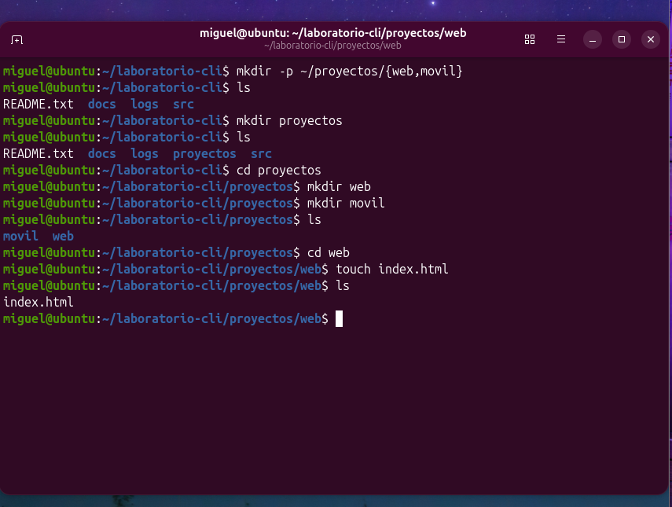
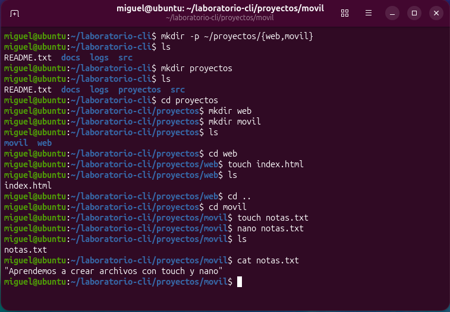
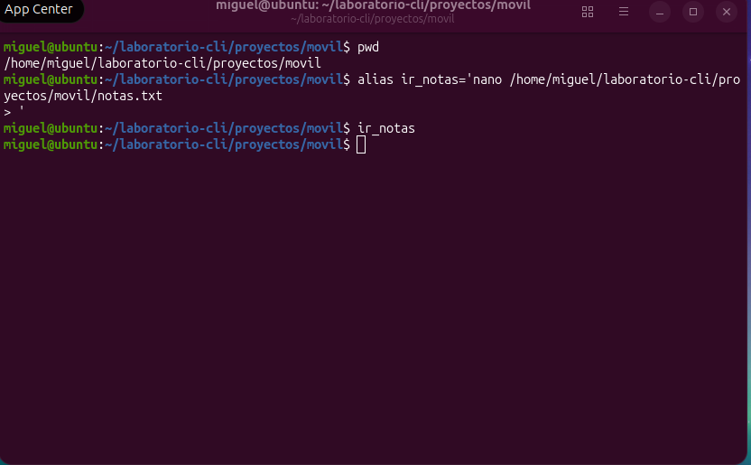
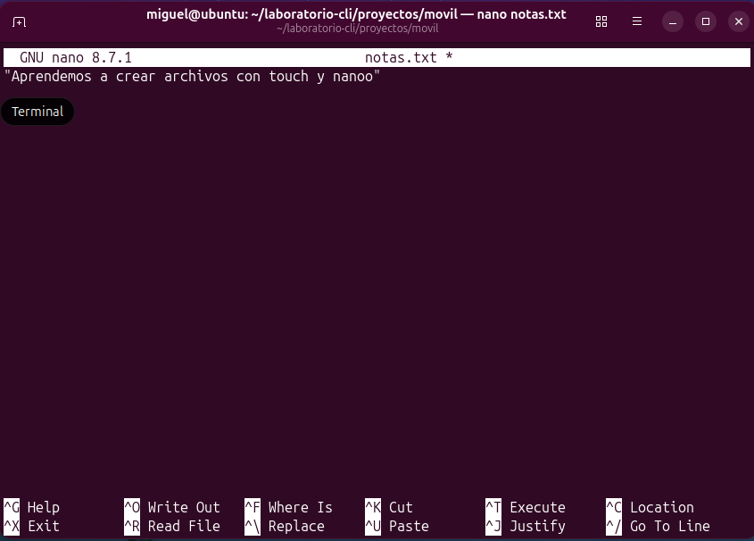
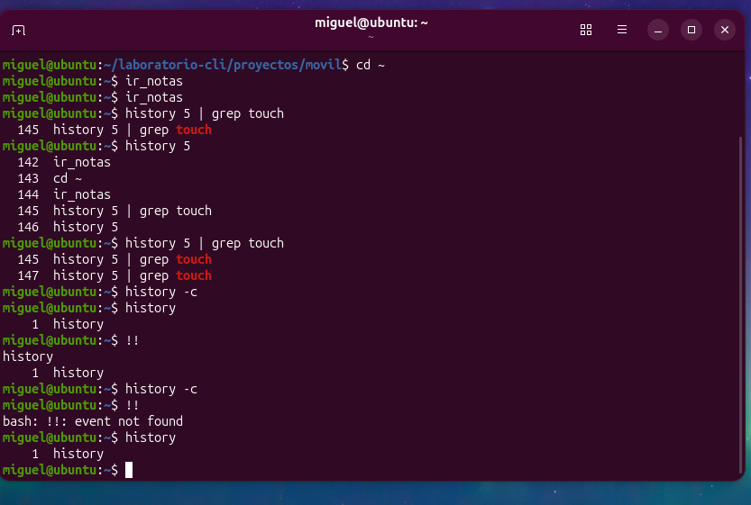
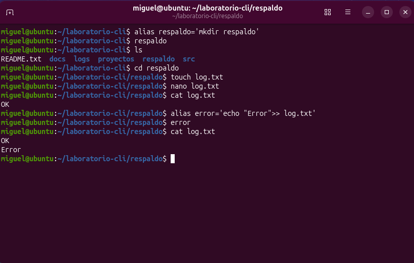
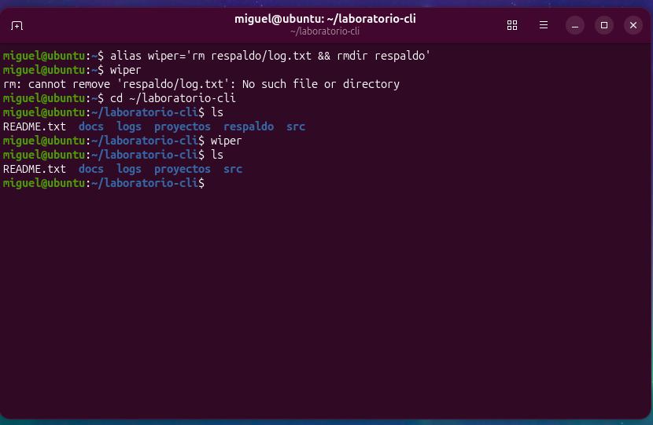

# Práctica - Laboratorio CLI

Crear dentro de `laboratorio-cli`:

---

## 1. Crear una carpeta `proyectos`

Dentro de `proyectos` crear las siguientes carpetas:

- `web`
- `movil`

Dentro de `web` crear un archivo:

`index.html`

Crear el archivo utilizando `touch`.

---

## 2. Crear el archivo `notas.txt`

Dentro de `proyectos/movil` crear el archivo:

`notas.txt`

Dentro de `notas.txt` colocar el texto:

> "Aprendemos a crear archivos con touch y nano"

Salir y mostrar el contenido de `notas.txt`.

---

## 3. Crear el alias `ir_notas`

Crear un alias llamado `ir_notas` que abra directamente desde
cualquier carpeta el archivo `notas.txt`.

El alias permite abrir directamente el archivo `notas.txt`
utilizando el editor `nano`.

---

## 4. Historial de comandos

Revisar el historial de los últimos 5 comandos y filtrar su
contenido para mostrar únicamente la ejecución de `touch`.

- Eliminar el historial de comandos.
- Ejecutar `!!`.
- Presentar el historial actual.

---

## 5. Crear los alias `respaldo`, `error` y `wiper`

Crear un alias llamado `respaldo` que genere una carpeta con el
mismo nombre.

- Ejecutar el alias `respaldo`.
- Entrar a la carpeta `respaldo`.
- Crear un archivo llamado `log.txt`.
- Dentro de `log.txt` colocar la palabra `OK`.
- Crear un alias llamado `error` que genere la palabra `Error`
  dentro del archivo `log.txt`.

Crear un alias llamado `wiper` que elimine el archivo `log.txt`
y la carpeta `respaldo`.

